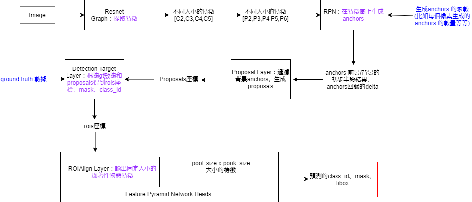

# Badminton_MRCNN
reference: https://github.com/matterport/Mask_RCNN
## Abstract
因了解到國內外重要體育賽事長期被熱烈關注而延伸出運動科學相關研究，而對人類體育活動進行科學化分析。本論文基於Mask Region based Convolution Neural Networks (Mask-RCNN)為主要模型，將YOUTUBE開放之國際羽球賽事的影片下載後，自動化截大量圖片作為本實驗之輸入資料。最終透過模型追蹤打者得到雙方的運動軌跡與動態圖，以便於往後更深入的研究。

本研究取在YOUTUBE上公開的2020世界羽球聯盟賽事中多組對打的影片作為我們的原始資料。將影片中需要的場景截圖並調整需要的大小，然後利用MRCNN偵測打者的移動軌跡與記錄其座標，並且根據圖片去修正座標的精準位置，得到更貼近真實的數據。並且不斷的將大量對打影片重複上面步驟，目的是為了收集龐大的對打數據最後讓RNN訓練並根據新的影片中的一小段落來預測最終可能的贏家。

### 關鍵字：機器學習、影片處理、圖像處理、物件偵測、遮罩型區域卷積神經網路、運動軌跡

## Prospects

## Step

## Methodology

## MRCNN

reference: https://blog.csdn.net/Cleo_Gao/article/details/116235091

## Pornpawee CHOCHUWONG vs. TAI Tzu Ying BWF2020
Winner: TAI Tzu Ying

### 每0.5秒截取一張圖片
### 大量圖片中篩選特定畫面
### 修正梯形至方形
### MRCNN 分析影像和紀錄座標
### GIF製作與路徑長分析

### 第一局

### 第二局

TAI Tzu Ying 路徑長:**573222.25**

Pornpawee CHOCHUWONG 路徑長:630499.75
<!---

--->

